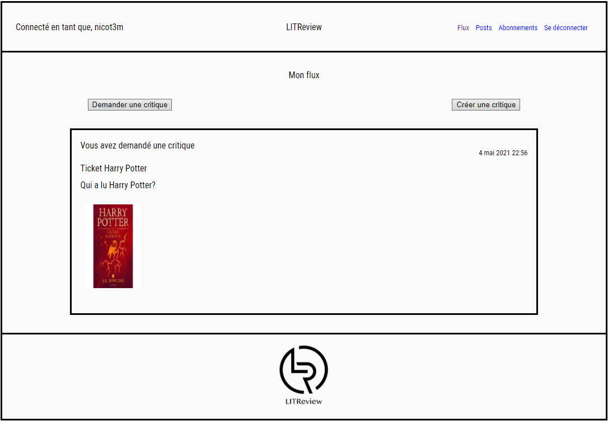

# LITReview v1

**_Projet réalisé lors de ma formation de Développeur d'application Python à OpenClassrooms_**

_**Web application MVP LITReview qui permet de:**_
* S'inscrire
* Se connecter
* Créer un ticket pour demander des critiques de livres
* Publier des critiques de livres
* Suivre d'autres utilisateurs

_**L'application est développée avec Django. Le projet Django litreview a deux applications:**_
1. account
1. review

_**Les données sont sauvées dans la base de données db.sqlite3**_

## Installation
* Python au minimum 3.9.1 doit-etre installé.
* Télécharger le package de l'application sous github, le dézipper et le ranger dans un nouveau répertoire.
* Sous windows 10 ouvrir un terminal avec la commande cmd depuis ce répertoire.
* Créer un environnement virtuel `python -m venv env`
* Activer l'environnement virtuel `env\Scripts\activate.bat`
* Installer la dernière version de pip `python -m pip install --upgrade pip`
* Installer les bibliothèques externes de Python `pip install -r requirements.txt`

## Utilisation
* Activer l'environnement virtuel `env\Scripts\activate.bat`
* Lancer le serveur avec la commande `python manage.py runserver`
* Dans votre navigateur préféré, accéder à l'application à l'adresse `http:/127.0.0.1:8000`
* Créer un compte pour pouvoir se connecter et accéder au site.
* Le mot de passe doit avoir au moins 8 caractères, des chiffres dans le désordre et des lettres. Il ne doit pas être commun.
* Pour accéder à l'administratin de django `http://127.0.0.1:8000/admin`
>Nom d’utilisateur : nicot3m
>
>Mot de passe : 123654abc
>
* Pour créer un nouvel administrateur dans le terminal `python manage.py createsuperuser`